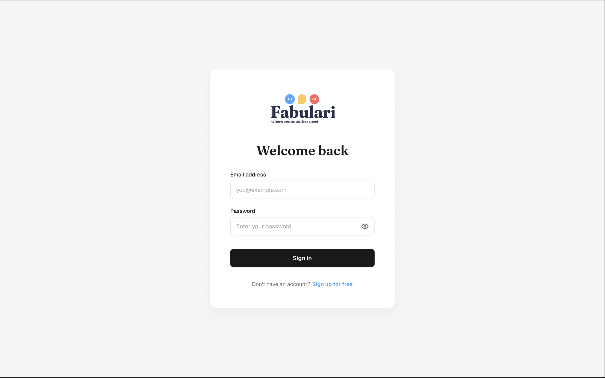
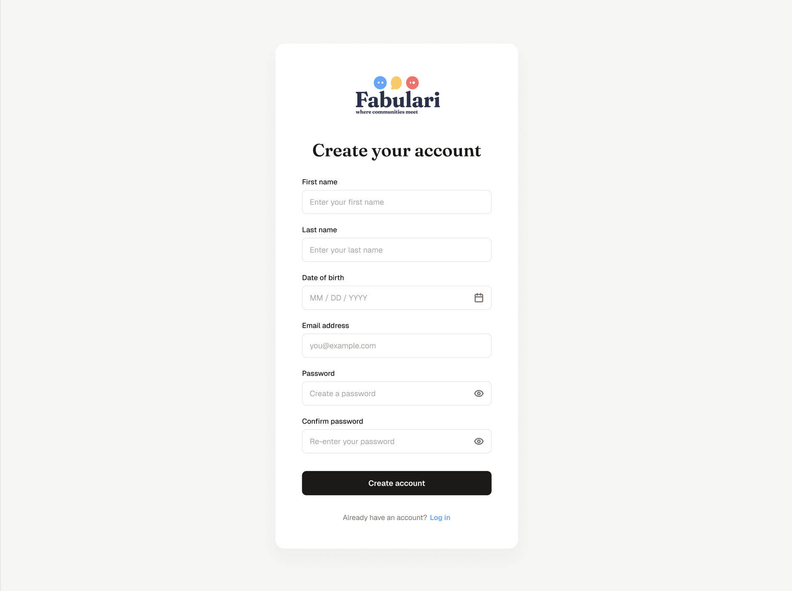
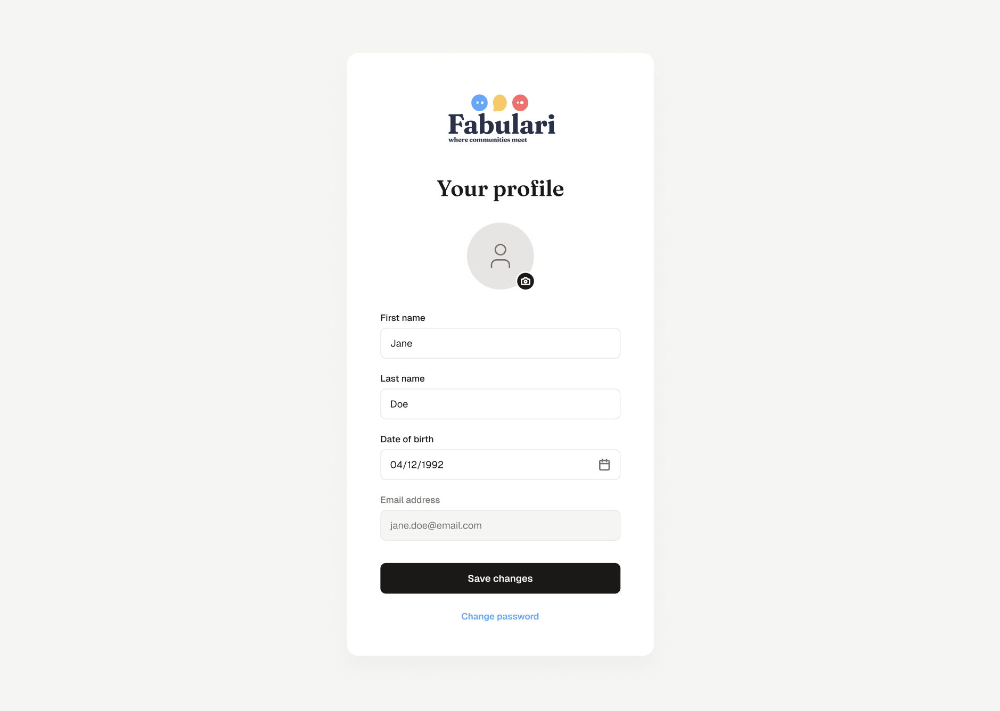
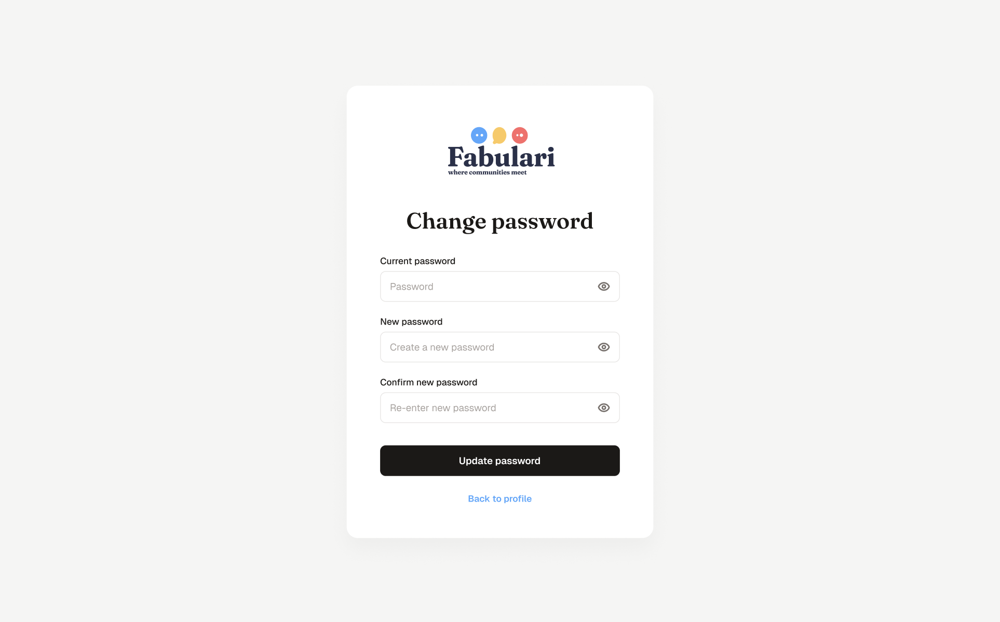

# Fabulari Phase 1

## Overview
Fabulari means "to chat" in Latin.
Fabulari is a real-time non-persistent chat application with groups and chat rooms that supports text and media.

### Groups
Groups are a collection of chat rooms. A Chat room contains several users above an age specified on creation of the group.

### Roles
There are three roles: Super Admin, Group Admin, and Member.

#### Super Admin
The Super Admin is the administrator of the entire application, responsible for creating / deleting groups and banning users from the platform.
They do not have chatting functions.

#### Group Admin
The Group Admin is the administrator of their respective group, responsible for creating / deleting chat rooms and banning users from the group.
Group Admins have chatting functions.

#### Member
A Member is a regular user with chatting functions.

## Git Strategy Outline
### Branches
All branches will be prefixed depending on the goal of the branch. The name of the branch will be [prefix]/[name].

| Prefix | Definition |
| ------ | ---------- |
| feat | new feature |
| bug | fixing a bug |
| wip | work-in-progress |

### Rebasing and Merging
To keep a clean commit history, rebasing will be used in tandem with merging.
Merging will occur for major feature and work-in-progress branches.
Rebasing will occur for documents / non-technical changes as well as minor bug fixes.

## Specifications and Assumptions
When refering to a specific requirement, the syntax (R[N]) will be used. For example, "look at (R1)".

| ID | Requirement | Assumption |
| - | - | - |
| 1 | Super Admin account is created by default on first app run | A setup script creates the Super Admin account with a configured email and password on deployment |
| 2 | Users send group creation / deletion requests to Super Admin | Super Admin sees a list of pending requests to approve or deny each one |
| 3 | Group Admins send ban requests to Super Admin | Request has a reason field |
| 4 | Groups have a title <= 30 characters, description <= 250 characters, and minimum age | Title must be unique. Age limit is enforced join-request time |
| 5 | Groups display a list of all members | Visible to all members, not only Group Admin |
| 6 | Group Admin approves or denies join request | Requester is notified of outcome |
| 7 | Group Admin can edit group description but not title | Editing the description is logged |
| 8 | Group Admin can customise group background colour | Choice of colour from a preset palette to avoid readablity issues |
| 9 | Group Admin must appoint a successor before leaving or deleting their account | Only chatters of the same group are eligible |
| 10 | Profile requires first name, last name, email, password, and age | Age is taken from date of birth for recalculation |
| 11 | Members can request for another member to be banned from the group | Request has a reason field. Request goes to Group Admin where they can ask the Super Admin to ban the user from the platform, ban them from the group, or deny the request |
| 12 | Members can delete their previous messages | Previous messages (after the 5th) are cached in sessionStorage. Message is replaced with "message deleted" rather than completely removed from the UI |
| 13 | Users can view a list of all existing groups | List shows title, description, age limit, but not the full member list |
| 14 | Members entering a chat room see 5 previous messages | Database stores only 5 messages and continously updates using a Ring Buffer approach |
| 15 | Members in a chat room are notified when another member enters or leaves said chat room | Notified with an inline message rather than push notification |
| 16 | Media files (PNG, JPEG, GIF) must be <=2MB | Files over 2MB are rejected on the front-end for immediate feedback and re-validated server-side |
| 17 | Internal links are hyperlinked, external are not | Server Side detection between internal and external links |
| 18 | Passwords must be >= 8 characters with 1 uppercase character | Numbers and symbols need not be included |
| 19 | Messages are timestamped | Timestamps are stored in UTC and displayed in the users' local timezone |
| 20 | Users can update all their information except email | Passwords can be changed if user knows old password. They cannot reset their forgotten password |
| 21 | All administrative actions are logged | Logs include userId, action, and timestamp. Visible only to the Super Admin |
| 22 | Rooms display a list of users currently in the room | Presence is tracked server-side in memory (not MongoDB) and pushed to clients via WebSocket |

## Data Structures

### Super Admin (Singleton)
| Field | Type | Notes |
| - | - | - |
| id | UUID |  |
| email | string, unique |  |
| password | string | >= 8 chars, 1 uppercase (R18), hashed |

### User
| Field | Type | Notes |
| - | - | - |
| id | UUID |  |
| image | binary (png, jpg) |  |
| firstName | string | (R10) |
| lastName | string | (R10) |
| email | string, unique | Cannot change after creation (R20) |
| password | string | >= 8 chars, 1 uppercase (R18), hashed |
| dob | date | Date-of-birth for age (R10) |
| isBanned | boolean | (R3) |

### Group
| Field | Type | Notes |
| - | - | - |
| id | UUID |  |
| adminIds | []UUID | References User.id |
| title | string, <=30 chars, unique | Cannot change after creation (R20) |
| description | string, <= 250 chars | Editable and logged (R7, R21) |
| minAge | int | (R4) |
| bgColor | string | (R8), stored as a hexcode string |

### Membership
| Field | Type | Notes |
| - | - | - |
| id | UUID |  |
| userId | UUID | References User.id |
| groupId | UUID | References Group.id |
| status | enum | active, banned (R11) |

### Room
| Field | Type | Notes |
| - | - | - |
| id | UUID |  |
| groupId | UUID | References Group.id |
| name | string |  |
| messages | RingBuffer<Message, 5> | See Message below |

### RoomPresence
| Field | Type | Notes |
| - | - | - |
| roomId | UUID | References Room.id |
| userId | UUID | References User.id |
| socketId | string | Detect disconnect and stale entries |

### Message
| Field | Type | Notes |
| - | - | - |
| id | UUID |  |
| authorId | UUID | References User.id |
| content | string | Sanitised (R17) |
| image | binary (png, jpg, gif) <=2MB | (R16) |
| isDeleted | boolean | (R12) |
| timestamp | datetime | Stored in UTC (R19) |

### CreateGroupRequest
| Field | Type | Notes |
| - | - | - |
| id | UUID |  |
| userId | UUID | References User.id |
| groupTitle | string, <=30 chars, unique |  |
| reason | string |  |
| status | enum | pending, approved, denied (R2) |

### DeleteGroupRequest
| Field | Type | Notes |
| - | - | - |
| id | UUID |  |
| userId | UUID | References User.id |
| groupId | UUID | References Group.id |
| reason | string |  |
| status | enum | pending, approved, denied (R2) |

### JoinRequest
| Field | Type | Notes |
| - | - | - |
| id | UUID |  |
| userId | UUID | References User.id |
| groupId | UUID | References Group.id |
| status | enum | pending, approved, denied (R6) |

### KickRequest
| Field | Type | Notes |
| - | - | - |
| id | UUID |  |
| requestorId | UUID | References User.id |
| targetId | UUID | References User.id |
| groupId | UUID | References Group.id |
| reason | string | (R11) |
| status | enum | pending, approved, denied |

### BanRequest
| Field | Type | Notes |
| - | - | - |
| id | UUID |  |
| requestorId | UUID | References User.id |
| sourceKickRequestId | UUID nullable | References KickRequest.id, nullable so Group Admin can request by themself |
| targetId | UUID | References User.id |
| reason | string | (R3) |
| status | enum | pending, approved, denied |

### Log
| Field | Type | Notes |
| - | - | - |
| id | UUID |  |
| actorId | UUID | References User.id |
| action | string |  |
| timestamp | datetime | Stored in UTC |

## Database Considerations (MongoDB)
### Reference Integrity
MongoDB does not enforce foreign keys. All fields referencing another collection's id (Membership.id, KickRequest.id) are validated and maintained server-side rather than by the database.

### Unique Indexes
| Collection | Field | Notes |
| - | - | - |
| User | email | (R20) |
| Group | title | (R4) |
| Membership | {userId, groupId} (compound) | Prevents duplicate membership rows. Supports fast lookup for (R5, R6, R9, R11) |

### Schema Validation
Enforced via MongoDB JSON Schema validators on each collection.

| Collection | Field | Allowed values |
| - | - | - |
| Membership | status | active, banned |
| CreateGroupRequest | status | pending, approved, denied |
| DeleteGroupRequest | status | pending, approved, denied |
| JoinRequest | status | pending, approved, denied |
| KickRequest | status | pending, approved, denied |
| BanRequest | status | pending, approved, denied |

### Embedded vs. Referenced Documents
| Structure | Storage | Rationale |
| - | - | - |
| Room.messages | Embedded array (cap 5) | Single document read for (R14) |
| Membership | Separate collection | Avoids unbounded array growth in Group |

## Angular Architecture
### Components
All components will before postfixed with "Component" in the codebase.
| Component | Description |
| --------- | ----------- |
| Home | Landing page that talks about Fabulari and links to the application |
| SignUp    | Page with first name, last name, DOB, email, password, confirm password |
| Login     | Page with email and password |
| Profile   | Page with profile picture, first name, last name, email |
| ChangePassword | Inputs with "current password", "new password", "confirm new password" |
| Sidebar | Role-dependent sidebar showing joined groups for members and group admins, for super admin it shows buttons for each kind of request |
| GroupList | Shows a list of existing groups to join |
| GroupDetail | Shows a specific groups title, description, age limit |
| RoomList | Shows list of rooms in current group |
| RoomUserList | Shows list of users in the current room |
| MemberList | Shows all members of group |
| ChatRoom | Main chat view containing messages, mesage input |
| Message | Single message |
| MessageInput | Text input and image upload |
| UserInOutNotification | Inline notification showing "user joined" or "user left" |
| GroupSettings | Edit description, pick background colour, delete group / appoint successor |
| JoinFormRequest | Form to join a group |
| KickFormRequest | Form to ban another user in a group |
| BanFormRequest | Form to ban another user from the platform |
| CreateGroupRequests | Pending requests for create group (User - Super Admin) |
| CreateGroupRequest | Single request for create group |
| DeleteGroupRequests | Pending requests for delete group (Super Admin) |
| DeleteGroupRequest | Single request for delete group |
| JoinRequests | Pending requests for joining group (Group Admin) |
| JoinRequest | Single request for join group |
| KickRequests| Pending requests for banning a user from a group (User - Group Admin) |
| KickRequests | Single request for banning a user from a group |
| BanRequests | Pending requests for banning a user from the platform (Group Admin - Super Admin) |
| BanRequests | Single request for banning a user from the app |
| Logs | Table of all admin logs |
| Popup | Displays a component within itself on top of the UI |
| NotFound | Shown on 404 |

### Services
All services (except for guards) will be postfixed with "Service" in the codebase.
| Service | Description |
| ------- | ----------- |
| AuthGuard | Guard against chatting without being logged in |
| RoleGuard | Guard against users accessing role restricted features |
| Timezone | Converts UTC to local timezone |
| MediaUpload | Validates file type and size |
| Requests | CRUD requests |
| Logs | CRUD logs |
| Messages | CRUD messages |
| Groups | CRUD groups |
| Room | CRUD rooms |
| Presence | Tracks which users are in which rooms currently |

### Routes
| Path | Component(s) | Guard(s) |
| ---- | ------------ | -------- |
| /    | Home         |  |
| /login | Login      |  |
| /signup | SignUp    |  |
| /profile | Profile  | AuthGuard |
| /change-password | ChangePassword | AuthGuard |
| /groups | Sidebar, GroupList | AuthGuard |
| /groups/:groupId | Sidebar, RoomList, GroupDetail, MemberList (if joined), JoinFormRequest (if not joined) | AuthGuard |
| /groups/:groupId/settings | Sidebar, RoomList, GroupSettings | AuthGuard, RoleGuard |
| /groups/:groupId/admin | JoinRequests, KickRequests | AuthGuard, RoleGuard |
| /groups/:groupId/rooms/:roomsId | Sidebar, ChatRoom, RoomUserList | AuthGuard, RoleGuard |
| /groups/:groupId/kick | Sidebar, KickFormRequest | AuthGuard, RoleGuard |
| /groups/:groupId/ban | Sidebar, BanFormRequest | AuthGuard, RoleGuard |
| /admin | Sidebar(CreateGroupRequests, DeleteGroupRequests, BanRequests, Logs) (sidebar of buttons) |
| /admin/create | Sidebar, CreateGroupRequests, Popup(CreateGroupRequests) | AuthGuard, RoleGuard |
| /admin/delete | Sidebar, DeleteGroupRequests, Popup(DeleteGroupRequest) | AuthGuard, RoleGuard |
| /admin/ban | Sidebar, BanRequests, Popup(BanRequest) | AuthGuard, RoleGuard |
| /admin/logs | Sidebar, Logs, Popup(Log) | AuthGuard, RoleGuard |

## Endpoints
### Auth
| Endpoint | Method | Description |
| -------- | ------ | ----------- |
| /auth/signup | post | Create an account |
| /auth/login | post | Validate account credentials |

### Profile
| Endpoint | Method | Description |
| -------- | ------ | ----------- |
| /profile | patch | Update profile information except email |
| /profile/:id | get | Retrieve a profile |

### Groups
| Endpoint | Method | Description |
| -------- | ------ | ----------- |
| /groups | get | Get all groups |
| /groups/:groupId | get | Get a single group |
| /groups/:groupId | patch | Update group settings |
| /groups/:groupId/members | Get | list of all members in the group |
| /groups/:groupId/successor | post | Appoint successor |
| /groups/:groupId/leave | delete | Leave a group |

### Group Requests (Create / Delete)
| Endpoint | Method | Description |
| -------- | ------ | ----------- |
| /create-group-requests | post | Submit a request to create a group |
| /create-group-requests | get | Pending requests for Super Admin |
| /create-group-requests/:id | patch | Approve or deny group creation |
| /delete-group-requests | post | Submit a request to delete a group |
| /delete-group-requests | get | Pending requests for Super Admin |
| /delete-group-requests/:id | patch | Approve or deny group deletion |

### Join Requests
| Endpoint | Method | Description |
| -------- | ------ | ----------- |
| /groups/:groupId/join-requests | post | Submit a request to join a group |
| /groups/:groupId/join-requests | get | Pending requests for Group Admin |
| /groups/:groupId/join-requests/:id | patch | Approve or deny join request |

### Kick Requests
| Endpoint | Method | Description |
| -------- | ------ | ----------- |
| /groups/:groupId/kick-requests | post | Submit a request to ban another user from the group |
| /groups/:groupId/kick-requests | get | Pending requests for Group Admin |
| /groups/:groupId/kick-requests/:id | patch | Approve or deny kick request |

### Ban Requests
| Endpoint | Method | Description |
| -------- | ------ | ----------- |
| /groups/:groupId/ban-requests | post | Submit a request to ban another user from the platform |
| /groups/:groupId/ban-requests | get | Pending requests for Super Admin |
| /groups/:groupId/ban-requests/:id | patch | Approve or deny kick request |

### Rooms
| Endpoint | Method | Description |
| -------- | ------ | ----------- |
| /groups/:groupId/rooms | get | Get all rooms |
| /groups/:groupId/rooms | post | Create a room |
| /groups/:groupId/rooms/:roomId | get | Get a single room |
| /groups/:groupId/rooms/:roomId | delete | Delete a room |
| /groups/:groupId/rooms/:roomId/presence | get | On room load, get current presence |

### Messages
| Endpoint | Method | Description |
| -------- | ------ | ----------- |
| /groups/:groupId/rooms/:roomId/messages | get | Get 5 last messages |
| /groups/:groupId/rooms/:roomId/messages | post | Send a message |
| /messages/:messageId | delete | Delete own message |

### Media
| Endpoint | Method | Description |
| -------- | ------ | ----------- |
| /media/upload | post | Validates an image (PNG, GIF, JPEG, <=2MB) |

### Admin
| Endpoint | Method | Description |
| -------- | ------ | ----------- |
| /admin/logs | get | List of all logs |

### WebSocket Events
| Event | Description |
| -------- | ----------- |
| `message:new` | Broadcast new message |
| `message:deleted` | Broadcast delete |
| `room:userJoined` | Broadcast and notify when a user joins a room |
| `room:userLeft` | Broadcast and notify when a user leaves a room |

## Design Documents
### Login

### Signup

### Profile

### Change Password

